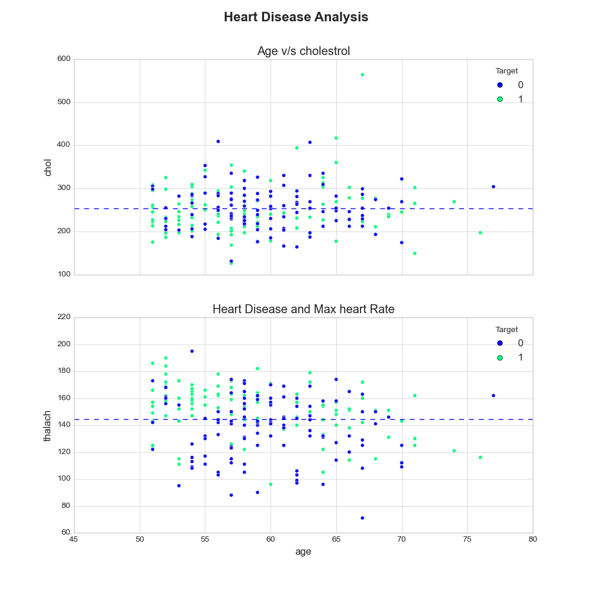

# Heart-Disease-Classification

This project focuses on developing a machine learning model to predict whether a person has heart disease based on a range of medical and demographic attributes. The aim is to assist early diagnosis and risk assessment using accessible patient data.

